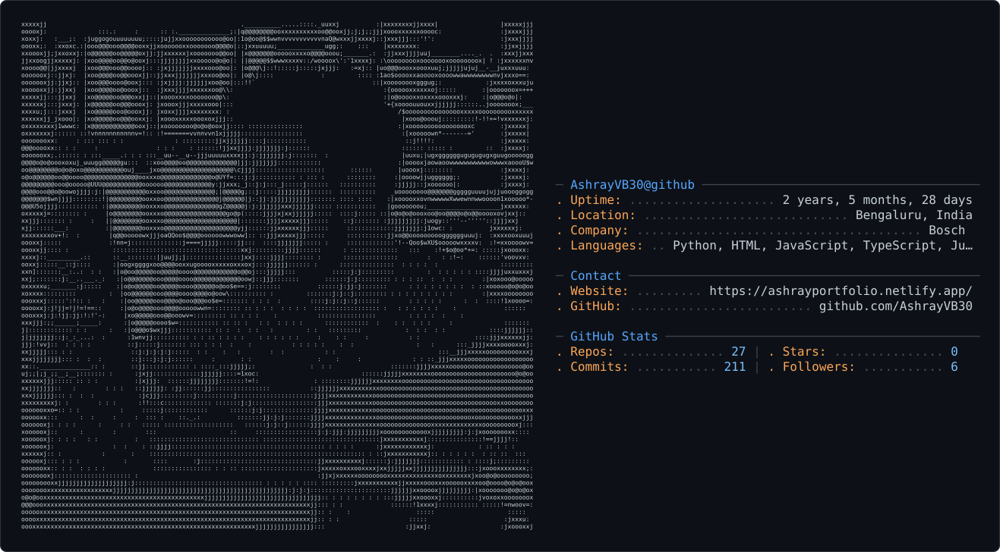

<!--
  AshrayVB30 — GitHub profile README
  Hero = the ASCII "neofetch" card (dark_mode.svg / light_mode.svg).
  Every widget below is themed to the card's palette so the page reads as one system:
    dark  → bg #0d1117 · title #58a6ff · text #c9d1d9 · icon/accent #ffa657 · border #30363d
    light → bg #ffffff · title #0969da · text #24292f · icon/accent #953800 · border #d0d7de
-->

<!-- ┌───────────────────────────── HERO ─────────────────────────────┐ -->
<div align="center">

<picture>
  <source media="(prefers-color-scheme: dark)" srcset="dark_mode.svg" />
  <source media="(prefers-color-scheme: light)" srcset="light_mode.svg" />
  
</picture>

<br/>

<a href="https://ashrayportfolio.netlify.app/">
  
</a>

<br/>


&nbsp;

&nbsp;


</div>
<!-- └─────────────────────────────────────────────────────────────────┘ -->

---

## <samp>&#8250; whoami</samp>

```text
Ashray V B  ~  AI & Full-Stack Developer
```

- 🤖 &nbsp;**AI & Full-Stack Developer** based in **Bengaluru, India** — currently building software @ **Bosch**
- 🧠 &nbsp;I build **intelligent systems with LLMs** (Gemini · GPT · Ollama) and **scalable full-stack apps**
- 🛠️ &nbsp;Comfortable end-to-end: **Python / FastAPI** on the back, **React / Vue / TypeScript** on the front
- 🔐 &nbsp;Drawn to **security tooling & developer productivity** — see [**AutoVuln**](https://github.com/AshrayVB30/AutoVuln-A-Hybrid-Vulnerability-Managment-System)
- 🌐 &nbsp;Portfolio → **[ashrayportfolio.netlify.app](https://ashrayportfolio.netlify.app/)**
- 💬 &nbsp;Ask me about **LLM integration**, **computer-vision** projects, or **full-stack architecture**

---

## <samp>&#8250; tech stack</samp>

**Languages**


**Frontend**


**Backend & AI / LLM**


**Data & Storage**


**Tooling & DevOps**


---

## <samp>&#8250; featured projects</samp>

<div align="center">
<table>
<tr>
<td align="center">
<a href="https://github.com/AshrayVB30/AutoVuln-A-Hybrid-Vulnerability-Managment-System">
<picture>
  <source media="(prefers-color-scheme: dark)" srcset="https://github-readme-stats.vercel.app/api/pin/?username=AshrayVB30&repo=AutoVuln-A-Hybrid-Vulnerability-Managment-System&border_color=30363d&bg_color=0d1117&title_color=58a6ff&text_color=c9d1d9&icon_color=ffa657" />
  <source media="(prefers-color-scheme: light)" srcset="https://github-readme-stats.vercel.app/api/pin/?username=AshrayVB30&repo=AutoVuln-A-Hybrid-Vulnerability-Managment-System&border_color=d0d7de&bg_color=ffffff&title_color=0969da&text_color=24292f&icon_color=953800" />
  
</picture>
</a>
</td>
<td align="center">
<a href="https://github.com/AshrayVB30/WorkProof">
<picture>
  <source media="(prefers-color-scheme: dark)" srcset="https://github-readme-stats.vercel.app/api/pin/?username=AshrayVB30&repo=WorkProof&border_color=30363d&bg_color=0d1117&title_color=58a6ff&text_color=c9d1d9&icon_color=ffa657" />
  <source media="(prefers-color-scheme: light)" srcset="https://github-readme-stats.vercel.app/api/pin/?username=AshrayVB30&repo=WorkProof&border_color=d0d7de&bg_color=ffffff&title_color=0969da&text_color=24292f&icon_color=953800" />
  
</picture>
</a>
</td>
</tr>
<tr>
<td align="center">
<a href="https://github.com/AshrayVB30/Dementia-Stage-Classifier">
<picture>
  <source media="(prefers-color-scheme: dark)" srcset="https://github-readme-stats.vercel.app/api/pin/?username=AshrayVB30&repo=Dementia-Stage-Classifier&border_color=30363d&bg_color=0d1117&title_color=58a6ff&text_color=c9d1d9&icon_color=ffa657" />
  <source media="(prefers-color-scheme: light)" srcset="https://github-readme-stats.vercel.app/api/pin/?username=AshrayVB30&repo=Dementia-Stage-Classifier&border_color=d0d7de&bg_color=ffffff&title_color=0969da&text_color=24292f&icon_color=953800" />
  
</picture>
</a>
</td>
<td align="center">
<a href="https://github.com/AshrayVB30/NutriTrack">
<picture>
  <source media="(prefers-color-scheme: dark)" srcset="https://github-readme-stats.vercel.app/api/pin/?username=AshrayVB30&repo=NutriTrack&border_color=30363d&bg_color=0d1117&title_color=58a6ff&text_color=c9d1d9&icon_color=ffa657" />
  <source media="(prefers-color-scheme: light)" srcset="https://github-readme-stats.vercel.app/api/pin/?username=AshrayVB30&repo=NutriTrack&border_color=d0d7de&bg_color=ffffff&title_color=0969da&text_color=24292f&icon_color=953800" />
  
</picture>
</a>
</td>
</tr>
</table>
</div>

---

## <samp>&#8250; github stats</samp>

<div align="center">

<picture>
  <source media="(prefers-color-scheme: dark)" srcset="https://github-readme-stats.vercel.app/api?username=AshrayVB30&show_icons=true&include_all_commits=true&count_private=true&rank_icon=github&border_color=30363d&bg_color=0d1117&title_color=58a6ff&text_color=c9d1d9&icon_color=ffa657" />
  <source media="(prefers-color-scheme: light)" srcset="https://github-readme-stats.vercel.app/api?username=AshrayVB30&show_icons=true&include_all_commits=true&count_private=true&rank_icon=github&border_color=d0d7de&bg_color=ffffff&title_color=0969da&text_color=24292f&icon_color=953800" />
  
</picture>
<picture>
  <source media="(prefers-color-scheme: dark)" srcset="https://github-readme-stats.vercel.app/api/top-langs/?username=AshrayVB30&layout=compact&langs_count=8&border_color=30363d&bg_color=0d1117&title_color=58a6ff&text_color=c9d1d9" />
  <source media="(prefers-color-scheme: light)" srcset="https://github-readme-stats.vercel.app/api/top-langs/?username=AshrayVB30&layout=compact&langs_count=8&border_color=d0d7de&bg_color=ffffff&title_color=0969da&text_color=24292f" />
  
</picture>

<br/>

<picture>
  <source media="(prefers-color-scheme: dark)" srcset="https://streak-stats.demolab.com?user=AshrayVB30&border=30363d&background=0d1117&stroke=30363d&ring=58a6ff&fire=ffa657&currStreakLabel=58a6ff&sideLabels=c9d1d9&currStreakNum=c9d1d9&sideNums=c9d1d9&dates=484f58&titleColor=58a6ff" />
  <source media="(prefers-color-scheme: light)" srcset="https://streak-stats.demolab.com?user=AshrayVB30&border=d0d7de&background=ffffff&stroke=d0d7de&ring=0969da&fire=953800&currStreakLabel=0969da&sideLabels=24292f&currStreakNum=24292f&sideNums=24292f&dates=8c959f&titleColor=0969da" />
  
</picture>

</div>

---

## <samp>&#8250; contribution graph</samp>

<div align="center">

<!--
  These SVGs are generated by .github/workflows/snake.yml and pushed to the
  `output` branch. They render once the workflow has run at least once
  (trigger it from the Actions tab via "Run workflow").
-->
<picture>
  <source media="(prefers-color-scheme: dark)" srcset="https://raw.githubusercontent.com/AshrayVB30/AshrayVB30/output/github-snake-dark.svg" />
  <source media="(prefers-color-scheme: light)" srcset="https://raw.githubusercontent.com/AshrayVB30/AshrayVB30/output/github-snake.svg" />
  
</picture>

</div>

---

## <samp>&#8250; connect</samp>

<div align="center">

<a href="https://ashrayportfolio.netlify.app/">
  
</a>
<a href="https://www.linkedin.com/in/ashray-v-b-1a1b01232/">
  
</a>
<a href="mailto:vbashray1@gmail.com">
  
</a>
<a href="https://github.com/AshrayVB30">
  
</a>

<br/><br/>

<sub><samp>Thanks for stopping by — feel free to explore the repos and reach out. 👋</samp></sub>

</div>
